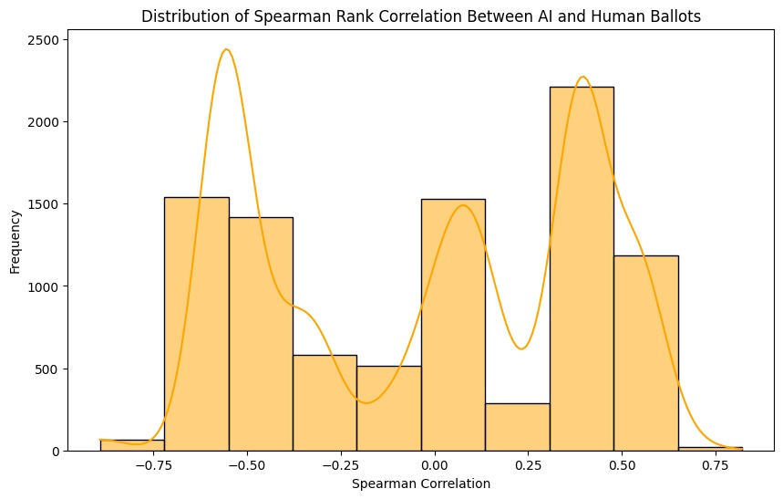
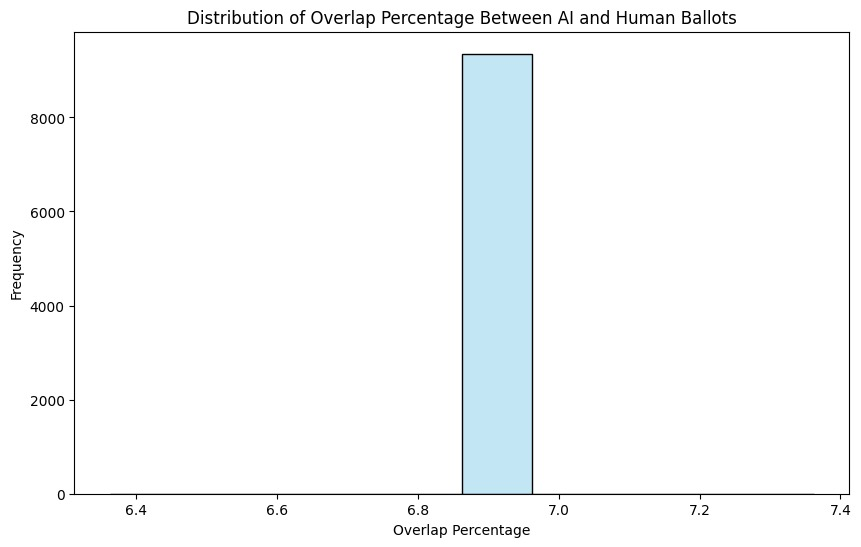

## Generative AI Voting: Fair Collective Choice is Resilient to LLM Biases and Inconsistencies
[](https://arxiv.org/abs/2406.11871)
[](https://colab.research.google.com/drive/1LO7LTrfJR8kamgS1dZFlZ1PXqpMm8SkQ)

### Overview

This project explores the application of generative AI models in participatory budgeting systems. It compares AI-generated ballots with human-generated ballots to analyze biases, overlaps, and alignment in decision-making. Two key allocation methods—Utilitarian Greedy and Equal Shares—were applied, followed by an analysis of the results through various metrics, including overlap percentages and rank correlations.

The project aimed to:

1. Implement AI and human-driven participatory budgeting systems.

2. Compare the decisions made by AI and humans using statistical and visual analyses.

3. Identify patterns of agreement, bias, and alignment between the two systems.

---

### How to Run locally:
1. Install the necessary Python packages:

```python
pip install -r requirements.txt
```

2. Place the dataset files (Participatory_Budgeting_Dataset.csv and Synthetic_Voter_Profiles.csv) in the same directory as the code.


3. Run the provided script.
```python
python3 btech_project.py
```

---

## Results

### 1. Utilitarian Greedy Allocations:

AI and human ballots led to significantly different allocations.

Human-generated ballots emphasized diversity in project selection, while AI-driven ballots leaned toward cost-efficiency and alignment with voter profiles.


### 2. Overlap Percentage:

Average overlap between AI and human-selected projects: 6.86%.

Indicates a low consensus between AI and human decision-making.


### 3. Spearman Rank Correlation:

Distribution ranged from -0.75 to +0.75, with peaks at ~-0.50 and ~+0.50.

Suggests moderate agreement in some cases but also highlights inverse rankings for certain voter profiles.

---

## Graphs and Visualizations

### 1. Spearman Rank Correlation Distribution:

Shows how AI and human rankings align or differ.

The bimodal distribution indicates variability in agreement and disagreement between the two groups.



### 2. Overlap Percentage Distribution:

Depicts the average overlap of selected projects between AI and human ballots.

Highlights the low alignment (~6.86%) between AI and human decisions.



---

## Conclusion

The analysis revealed limited consensus between AI and human ballots, highlighting the distinct priorities of each system.

Spearman rank correlations and overlap percentages emphasize that while AI prioritizes efficiency, human decisions may focus on broader factors like social impact and diversity.

These findings provide valuable insights for integrating generative AI in participatory budgeting systems, balancing efficiency with fairness.

---
